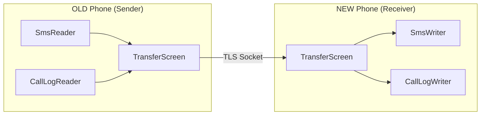
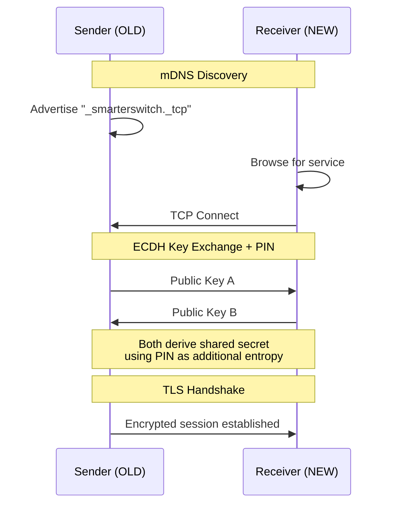
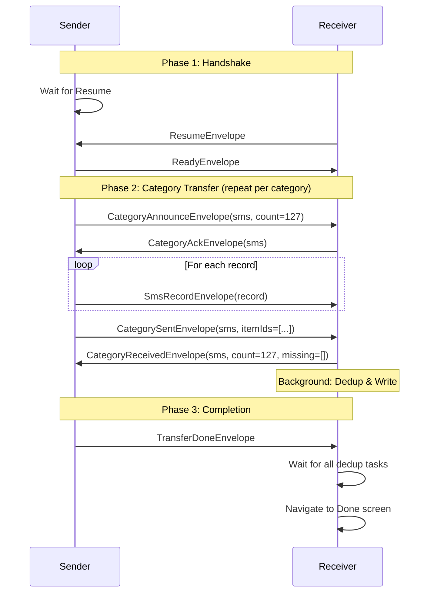
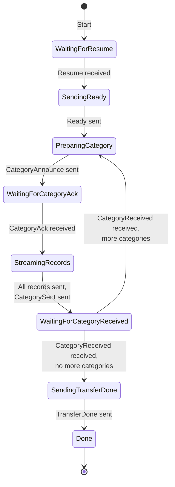
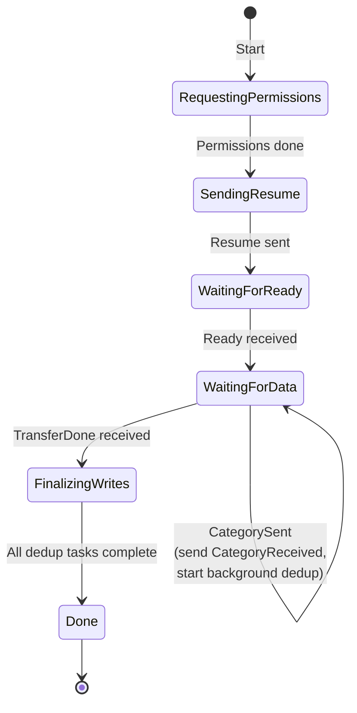
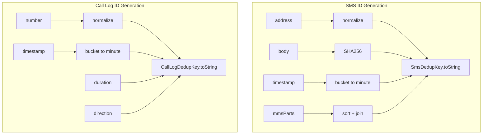
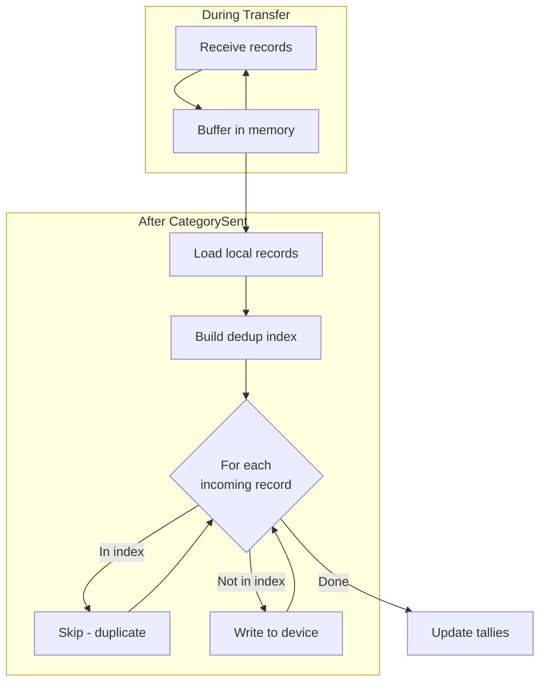
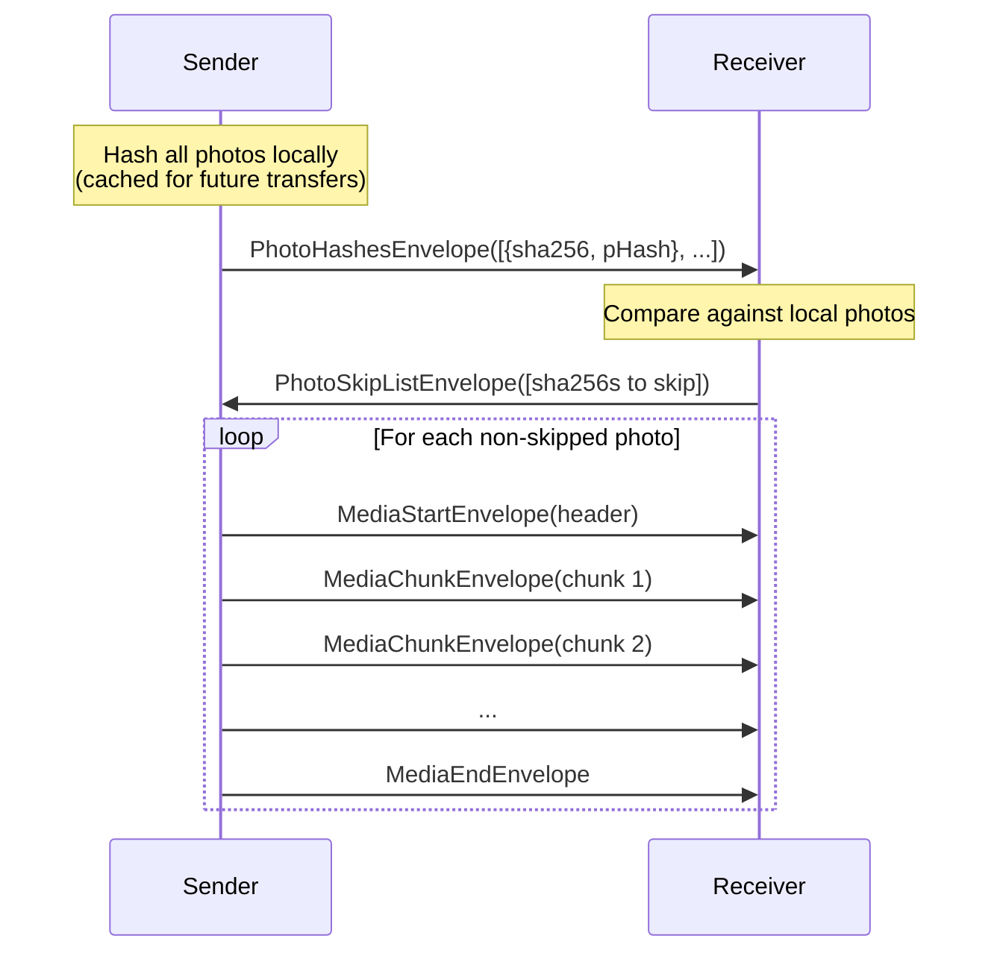

# Transfer Protocol v0.18

This document describes the transfer protocol used by SmarterSwitch to migrate data between two Android phones over a secure Wi-Fi connection.

## Overview

The transfer happens over a TLS-encrypted TCP socket between two phones on the same local network. One phone acts as the **sender** (OLD phone) and the other as the **receiver** (NEW phone).



## Connection & Pairing

Before transfer begins, the phones establish a secure connection:



## Transfer Flow

### High-Level Sequence



### Sender State Machine



### Receiver State Machine



## Envelope Types

All data is transmitted as JSON-encoded envelopes with a `kind` field for dispatch.

### Handshake Envelopes

| Envelope | Direction | Purpose |
|----------|-----------|---------|
| `ResumeEnvelope` | R → S | Receiver confirms listener is attached |
| `ReadyEnvelope` | S → R | Sender confirms it will start streaming |

### Category Control Envelopes

| Envelope | Direction | Purpose |
|----------|-----------|---------|
| `CategoryAnnounceEnvelope` | S → R | Announces category + item count |
| `CategoryAckEnvelope` | R → S | Confirms ready to receive category |
| `CategorySentEnvelope` | S → R | All items sent, includes item IDs for verification |
| `CategoryReceivedEnvelope` | R → S | Confirms receipt, lists any missing IDs |

### Data Envelopes

| Envelope | Category | Contents |
|----------|----------|----------|
| `SmsRecordEnvelope` | SMS/MMS | address, body, timestamp, type, threadId, mmsParts |
| `CallLogRecordEnvelope` | Call Log | number, timestamp, duration, direction, cachedName |
| `ContactRecordEnvelope` | Contacts | displayName, phones, emails, sourceAccountType |
| `CalendarEventEnvelope` | Calendar | uid, title, location, start/end times, recurrence |
| `MediaStartEnvelope` | Photos | sha256, fileName, byteSize, mimeType, kind |
| `MediaChunkEnvelope` | Photos | sha256, offset, base64-encoded bytes |
| `MediaEndEnvelope` | Photos | sha256 (signals file complete) |

### Completion Envelopes

| Envelope | Direction | Purpose |
|----------|-----------|---------|
| `CategoryDoneEnvelope` | S → R | Legacy: category complete (kept for back-compat) |
| `TransferDoneEnvelope` | S → R | All categories complete |

## Item ID Tracking

Each record is assigned a hash-based ID for deduplication and verification:



## Deduplication Flow

The receiver performs deduplication **after** all records for a category are received:



## Photos: Pre-flight Hash Protocol

Photos use a special pre-flight protocol to avoid sending duplicates:



## Error Handling

### Timeouts

| Wait | Timeout | Action on Timeout |
|------|---------|-------------------|
| Resume | 120s | Show "other phone not ready" error |
| Ready | 30s | Proceed anyway (best effort) |
| CategoryAck | 30s | Throw protocol error |
| CategoryReceived | 60s | Throw protocol error |

### Fire-and-Forget Acks

Receiver sends acks without blocking:

```dart
// Non-blocking - schedules send, continues immediately
session.sendFrame(CategoryAckEnvelope(category: cat).toBytes())
    .catchError((Object _) {});
```

This prevents the receiver's frame listener from blocking while waiting for socket writes.

## Wire Format

Each envelope is JSON-encoded and framed with a 4-byte big-endian length prefix:

```
┌─────────────┬────────────────────────────────────┐
│ Length (4B) │ JSON Payload (variable)            │
├─────────────┼────────────────────────────────────┤
│ 00 00 00 2A │ {"kind":"sms_record","record":{...}}│
└─────────────┴────────────────────────────────────┘
```

## Version History

| Version | Changes |
|---------|---------|
| v0.18.2 | Simplified to fire-and-forget acks, removed batch acks |
| v0.18.0 | Added CategoryAnnounce/Ack/Sent/Received handshakes |
| v0.17.3 | Added Ready handshake after Resume |
| v0.17.0 | Buffer-then-dedup receiver flow |
| v0.16.9 | Per-record acks for progress sync |
